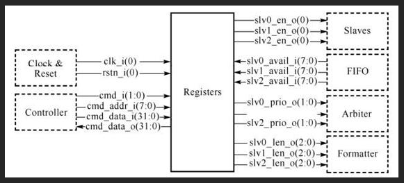
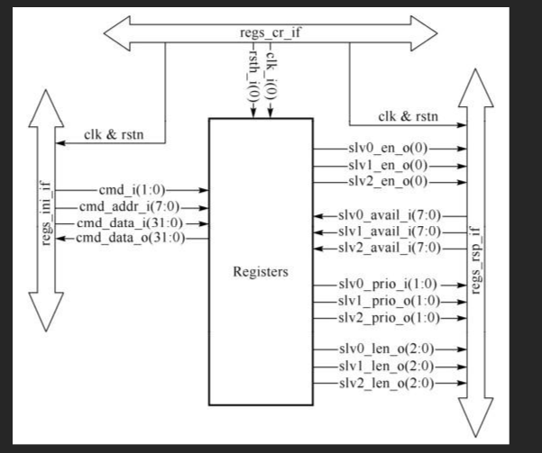
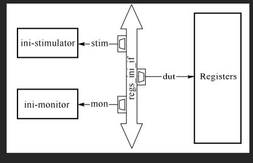
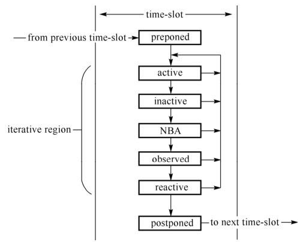

# systemverilog

## 1. 数据类型

SV中新引入了一个数据类型logic，便验证人员驱动和连接硬件模块而省去考虑使用reg还是使用wire的精力。

* logic为四值逻辑，即可以表示0、1、X、Z。（integer、reg、logic、net-type）
* bit为二值逻辑，只可以表示0和1。byte、shortint、int、longint、bit）

## 2. 参数使用

例如：

```
module ctrl_regs5
#（parameter int addr_width=8,
parameter int data_width=32）
（
input[addr_width-1:0]cmd_addr_i,
input[data_width-1:0]　cmd_data_i,
output[data_width:0]cmd_data_o,
）;
endmodule
```

对此，可以在模块例化时再决定端口的宽度，例如：

```
trl_regs5 #（.addr_width（16））regs5_inst（...）;
```

代码编译运行的过程分为三个部分：

* 编译阶段（compilation）：工具通过阅读目标代码，进行语法和语义分析，将每个模块分别编入库中（library）。
* 建模阶段（elaboration）：工具将各模块按照设计集成关系最终组成顶层模块。这一过程包括各模块（module）的例化、接口（interface）例化、程序（program）例化、层次集成、计算参数、解决层次信号引用、建立模块连接等。这一过程发生在编译阶段之后、仿真阶段之前，类似于软件编译的link阶段。
* 仿真阶段（simulation）：通过读取建模阶段的对象文件，建立硬件RTL模型和验证环境，以周期驱动（cycle-driven）或事件驱动（event-driven）的方式进行仿真。

VCS可以在独立的elaboration阶段修改参数。

## 3. 宏定义

公共使用的宏存放在公共空间作为头文件（header file）

```
'define ADDR_WIDTH 6
'define DATA_WIDTH 32
module ctrl_regs6
（
input['ADDR_WIDTH-1:0]cmd_addr_i,
input['DATA_WIDTH-1:0]cmd_data_i,
output['DATA_WIDTH:0]cmd_data_o,
）;
endmodule
```

## 4. 接口



我们采用接口（interface）进行stimulator与DUT的连接。interface的基本作用是对各个模块做清晰有序的连接,可以看做一捆智能的集束线（collector）。能将DUT同testbench的连接隔离开。

### 接口连接方式

该方式则定义了三个接口：regs_cf_if、regs_ini_if和regs_rsp_if。




```
interface regs_cr_if;
logic clk;
logic rstn;
endinterface: regs_cr_if

interface regs_ini_if
#（parameter int addr_width=8,
parameter int data_width=32）;
logic　　　　　　　　　　clk;
logic　　　　　　　　　　rstn;
logic[1:0]　　　　　　cmd;
logic[addr_width-1:0]　cmd_addr;
logic[data_width-1:0]　cmd_data_w;
logic[data_width-1:0]　cmd_data_r;
endinterface: regs_ini_if

interface regs_rsp_if;
logic　　　　clk;
logic　　　　rstn;
logic[7:0]slv0_avail;
logic[7:0]slv1_avail;
logic[7:0]slv2_avail;
logic[2:0]slv0_len;
logic[2:0]slv1_len;
logic[2:0]slv2_len;
logic[1:0]slv0_prio;
logic[1:0]slv1_prio;
logic[1:0]slv2_prio;logic　　　　slv0_en;
logic　　　　slv1_en;
logic　　　　slv2_en;
endinterface:　 regs_rsp_if
```

唯一不能使用logic变量的是含有多驱动（multi-drive）的场景，这时必须使用连线类型（如wire）。

### 接口应用

regs_cr_if的功能是提供时钟和复位信号，这里我们可以在regs_cr_if中产生时钟和复位信号。

```
interface regs_cr_if;
logic clk;
logic rstn;
initial begin
clk <=0;
forever begin
#5ns clk <=!clk;
end
end
initial begin
#20ns;
rstn <=1;
#40ns;
rstn <=0;#40ns;
rstn <=1;
end
endinterface: regs_cr_if
```

接口本身既要与DUT连接，也要与stimulator和monitor连接，不同对象的连接信号方向也是不同的。为了限制不同对象对其信号的访问权限和方向，接口通过modport做进一步的声明，以确立信号连接的方向。

```
interface regs_ini_if;
...//省略了接口信号声明
modport dut（
input　cmd,cmd_addr,cmd_data_w,
output cmd_data_r
）;
modport stim（
input　cmd_data_r,
output cmd,cmd_addr,cmd_data_w
）;
modport mon（input cmd,cmd_addr,cmd_data_w,cmd_data_r
）;
endinterface: regs_ini_if
```

在regs_ini_if实体中，进一步定义了3个modport:dut,stim和mon。它们分别用来作为DUT,stimulator和mon的“插座”，这样一方面澄清了各个对象可以连接的interface信号，一方面通过限制方向避免了反向驱动的问题。



## 5. SV仿真调度机制

SV的仿真调度完全支持Verilog的仿真调度，同时又扩展出来支持新的SV结构体，如程序（program）和断言（assertion）



建议将设计部分放置在module中，而将测试采样部分放置在program中。program中的initial块（类软件的执行方式）会在reactive区域被执行，而program之外的initial块（module内部）则在active区域被执行。

## 6. SV组件实现

### 激励发生器的驱动
